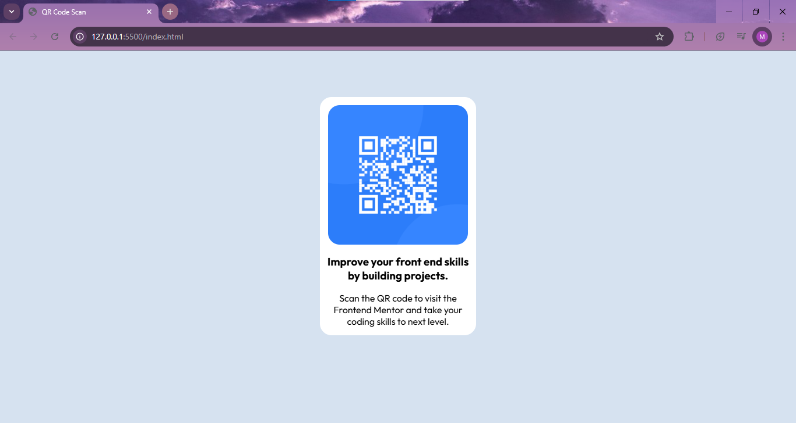

# Frontend Mentor - QR code component solution

This is a solution to the [QR code component challenge on Frontend Mentor](https://www.frontendmentor.io/challenges/qr-code-component-iux_sIO_H). Frontend Mentor challenges help you improve your coding skills by building realistic projects. 

## Table of contents

- [Overview](#overview)
  - [Screenshot](#screenshot)
  - [Links](#links)
- [My process](#my-process)
  - [Built with](#built-with)
  - [What I learned](#what-i-learned)
  - [Continued development](#continued-development)
  - [Useful resources](#useful-resources)
- [Author](#author)
- [Acknowledgments](#acknowledgments)

## Overview

### Screenshots

### Links
- Solution URL: [QR code Solution - GitHub Repo](https://github.com/mariamkhan04/HTML---CSS-Projects.git)
- Live Site URL: [Live Site Url](https://01qrcode.netlify.app/)

## My process

### Built with

- Semantic HTML5 markup
- CSS custom properties
- Flexbox
- CSS Grid

### What I learned

Working on this project helped me strengthen my understanding of creating responsive components using CSS Grid and Flexbox. Additionally, I got hands-on experience with semantic HTML5 and practiced importing and using custom fonts.

### Continued development

In the future, I plan to explore more about:

    -Advanced CSS animations to make my projects more interactive.

    -Learning and applying JavaScript for dynamic components.

### Useful resources

-[MDN Web Docs](https://developer.mozilla.org/en-US/) - This is my go-to reference for understanding HTML and CSS properties.

-[Google Fonts](https://fonts.google.com/) -  Helped me easily import and use the "Outfit" font family.

## Author

- LinkedIn - [mariamkhan-0424](https://www.linkedin.com/in/mariam-khan0424)
- Frontend Mentor - [@mariamkhan04](https://www.frontendmentor.io/profile/mariamkhan04)
- GitHub - [mariamkhan04](https://github.com/mariamkhan04)

## Acknowledgments

Thanks to Frontend Mentor for providing this amazing challenge. It’s always fun and educational to work on real-world projects!