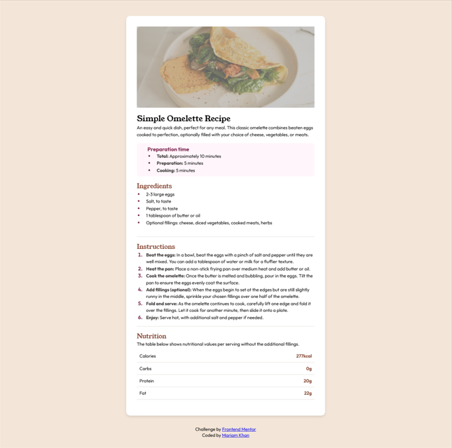

# Frontend Mentor - Recipe page solution

This is a solution to the [Recipe page challenge on Frontend Mentor](https://www.frontendmentor.io/challenges/recipe-page-KiTsR8QQKm). This challenge helped me improve my HTML and CSS skills by building a realistic project.

## Table of contents

- [Overview](#overview)
  - [Screenshot](#screenshot)
  - [Links](#links)
- [My process](#my-process)
  - [Built with](#built-with)
  - [What I learned](#what-i-learned)
  - [Continued development](#continued-development)
- [Author](#author)

## Overview 

### Screenshot

### Links

- Solution URL: [Add solution URL here](https://your-solution-url.com)
- Live Site URL: [Add live site URL here](https://your-live-site-url.com)

## My process

### Built with

- CSS custom properties
- Flexbox
- Responsive design
- Google Fonts

### What I learned

This project helped me enhance my CSS skills, particularly:

- Styling lists with custom colors and spacing.
- Using ::marker to modify list markers.
- Improving typography with Google Fonts.
- Responsive styling using Flexbox.

### Continued development

In the future, I plan to:

- Add animations for a better user experience.
- Implement JS for interactivity.

## Author

- LinkedIn - [mariamkhan-0424](https://www.linkedin.com/in/mariam-khan0424)
- Frontend Mentor - [@mariamkhan04](https://www.frontendmentor.io/profile/mariamkhan04)
- GitHub - [mariamkhan04](https://github.com/mariamkhan04)